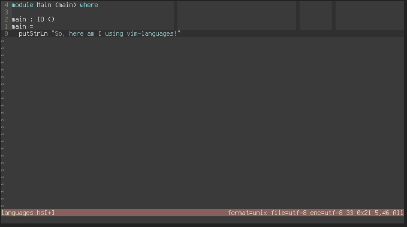

# vim-languages

This is a very simple plugin that generates Vim commands to add or remove the extension
pragmas.  Different GHC versions support different extensions, so the output of

```sh
$ ghc --supported-languages
```

is used to determine what commands to generate.  It should be fairly robust: `--supported-languages`
switch exists since at least GHC 7.6.  The plugin supports [pathogen][vim-pathogen], so
to install it just run:

```sh
mkdir -p ~/.vim/bundle && cd ~/.vim/bundle && git clone git@github.com:supki/vim-languages
```

By default, the commands for the following extensions are generated:

  - `NoImplicitPrelude`, `NoMonomorphismRestriction`
  - Any extension that does not have `No` prefix but `Rank2Types` and `NPlusKPatterns`

The command name is the name of the extension, so

```vim
:RankNTypes
```

will add

```haskell
{-# LANGUAGE RankNTypes #-}
```

Another call to `:RankNTypes` will remove the pragma.

The list of commands to generate is customizable:

  - Add `let g:vim_languages_exclude = ['Rank2Types', 'NPlusKPatterns', ...]` line to
    your `~/.vimrc` to exclude more commands from being generated

  - Add `let g:vim_languages_include = ['NoImplicitPrelude', 'NoMonomorphismRestriction]`
    line to your `~/.vimrc` to generate more commands

  - Inclusion has a higher precedence

_Note_ that the plugin expects the file to have all LANGUAGE pragmas as one big block
at the top; it tolerates the single line comment syntax and pre-processor instructions
but nothing else (e.g. OPTIONS_GHC pragmas interspersed in the list of LANGUAGE pragmas
will break everything)




  [vim-pathogen]: https://github.com/tpope/vim-pathogen
